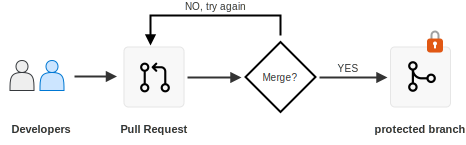
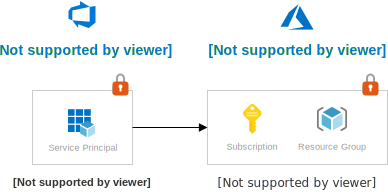

# Concept - Multi-tier Governance

### Abstract

When developing a governance model for your organization, it is important to remember that Azure Resource Management (ARM) is only _one_ way to manage resources. Other deployment methods must also be secured and governance applied.

By introducing automation via CI/CD pipelines, be aware that the Role Based Access Control (RBAC) model must be applied at **multiple layers**. This code sample deploys many of these layers and show how they can be configured together in a unified governance model. 

The following diagram illustrates a baseline CI/CD workflow with [Azure DevOps](https://dev.azure.com). The red lock icon  indicates security permissions which must be configured by the user. Not configuring or mis-configuring permissions will leave your workloads vulnerable.


To successfully secure your workloads, you must leverage a combination of security permissions configurations and human checks in your workflow. RBAC will prevent individual developers from making destructive changes. Build pipelines, however often run with privileged identities and will happily destroy your workloads if instructed to do so in the pipeline code. To prevent this from happening, you should configure [branch policies](https://docs.microsoft.com/en-us/azure/devops/repos/git/branch-policies?view=azure-devops) on your repository to require human approval before accepting changes that trigger automation pipelines.

| Deployment Step | Responsibility | Description |
|:--|:--|:--|
| **Pull Requests** | User | Engineers should peer review their work especially the Pipeline code. |
| **Branch Protection** | [Shared](https://docs.microsoft.com/en-us/azure/security/fundamentals/shared-responsibility) | Configure [Azure DevOps](https://docs.microsoft.com/en-us/azure/devops/repos/git/branch-policies?view=azure-devops) or [GitHub](https://docs.github.com/en/free-pro-team@latest/github/administering-a-repository/about-protected-branches) to reject changes that do not meet certain standards, e.g. CI checks and peer reviews (via pull requests). |
| **Pipeline as Code** | User | A build server will happily delete your production environment if the pipeline code instructs it to do so. Prevent this using a combination of pull requests and branch protection rules. |
| **[Service Connections](https://docs.microsoft.com/en-us/azure/devops/pipelines/library/service-endpoints?view=azure-devops&tabs=yaml)** | [Shared](https://docs.microsoft.com/en-us/azure/security/fundamentals/shared-responsibility) | Configure Azure DevOps to restrict access to these credentials. |
| **Azure Resources** | [Shared](https://docs.microsoft.com/en-us/azure/security/fundamentals/shared-responsibility) | Configure RBAC in the Azure Resource Manager. |

Before examining the governance layers in detail, please consider the use case and assumptions of this example organization.

## Example Use Case, Business Requirements

This demo is open source and intended to be used as a **Teaching Tool** for organizations who are new to DevOps and need to create a governance model for deploying to Azure. Please read this carefully to understand the decisions behind the model used in this sample repository. 

Any governance model must be tied to the organization's business rules, which are reflected in any technical implementation of access controls. This example model uses a fictitious company with common requirements:

- **Business Units**  
  The organization has many vertical business units, e.g. "fruits" and "vegetables", which operate largely independently.
- **Central-IT**  
  There is a central IT team, specializing in cloud infrastructure that manages shared services used by business units. This team is called [Cloud Center of Excellence](https://docs.microsoft.com/en-us/azure/cloud-adoption-framework/organize/cloud-center-of-excellence) in Microsoft's [Cloud Adoption Framework (CAF)](https://docs.microsoft.com/en-us/azure/cloud-adoption-framework) terminology.  
- **AAD Groups**  
  Every team has a subset of developers called "admins" with elevated privileges.
- **Deployment Environments**  
  Every team has 2 environments
  - Production - only admins have elevated privileges
  - Non-production - all developers have elevated privileges (to encourage experimentation and innovation)
- **Automation Goals**   
  Every application should implement DevOps, not just continuous integration (CI) but also (CD), i.e. deployments can be automatically triggered via changes to the git repository.
- **Cloud Journey - so far**  
  The organization started with an isolated project model to accelerate the journey to the cloud. But now they are exploring options to break silos and encourage collaboration by creating the "collaboration" and "supermarket" projects.

## Azure Active Directory (AAD)

Azure Active Directory is central identity provider and will be leveraged on both Azure DevOps and ARM layers. The overlapping triangles illustrate common pattern of leveraging [additive permissions](https://docs.microsoft.com/en-us/azure/role-based-access-control/overview#multiple-role-assignments).

In this example, each business domain has 2 AAD groups: a general group and a subset for admins only.


### Roles

The groups are assigned the following built-in roles in Azure and AzureDevOps. In both business units, administrators are given elevated privileges. 

| Group Name | ARM Role | Azure DevOps Role |
|:--|:--|:--|
| `fruits` | Contributor | Contributor |
| `fruits-admins` | Owner | Project Administrators |
| `veggies` | Contributor | Contributor |
| `veggies-admins` | Owner | Project Administrators |

In most cases, an `Owner` or `Project Administrator` has additional permissions to configure the product that can change the governance model. 

---

## Layer - Safeguard your Source Code with Branch Policies

Because your source code defines and triggers deployments, your first line of defense is to secure your source code management (SCM) repository. In practice, this is achieved by using the [Pull Request workflow](https://docs.microsoft.com/en-us/azure/devops/repos/git/pull-requests-overview?view=azure-devops) and in combination with [branch policies](#) which define checks and requirements before code can be accepted. 



When planning your end to end governance model, your privileged users, e.g. `veggies-admins` will be responsible for configuring branch protection. Common branch protection checks to secure your deployments include:

- **Require CI build to pass**   
  Useful for establishing baseline code quality, e.g. code linting, unit tests and even security checks e.g. virus and credential scans.

- **Require peer review**  
  Have another human double check that code works as intended. Be extra careful when changes are made to pipeline code. Combine with CI builds to make peer reviews less tedious. 

#### What happens if a developer tries to push directly to production?

Remember that git is distributed SCM system. A developer may choose to commit directly to their local `production` branch. But when configured, this push can be rejected by the git server. For example:

```
remote: Resolving deltas: 100% (3/3), completed with 3 local objects.
remote: error: GH006: Protected branch update failed for refs/heads/main.
remote: error: Required status check "continuous-integration" is expected.
To https://github.com/Azure-Samples/devops-governance
 ! [remote rejected] main -> main (protected branch hook declined)
error: failed to push some refs to 'https://github.com/Azure-Samples/devops-governance'
```

Please note the workflow above is vendor agnostic. The pull request and branch protection features are available from multiple SCM providers including [Azure Repos](https://azure.microsoft.com/services/devops/repos/), [GitHub](https://github.com) and [GitLab](https://gitlab.com).

Once the code has been accepted into a protected branch the next layer of access controls will be applied by the build server, e.g. [Azure Pipelines](https://azure.microsoft.com/services/devops/pipelines/).

## Layer - Secure Access to your Deployment Environments

To deploy to Azure, Azure Pipelines needs access to your Azure resources. When deploying to Azure from a headless CI/CD agent, use a [service principal](https://docs.microsoft.com/en-us/azure/active-directory/develop/app-objects-and-service-principals) to which you also apply role based access controls. For example, create separate service principals for your production and non-production environments.

### What is a Service Connection?

In Azure DevOps, a [Service Connection](https://docs.microsoft.com/azure/devops/pipelines/library/service-endpoints?view=azure-devops&tabs=yaml) is essentially credentials used to access external resources, e.g. ARM, GitHub or Docker Hub. Because we are deploying to Azure, our Service Connections will be Service Principals.



_Note: the ["Environments"](https://docs.microsoft.com/azure/devops/pipelines/process/environments?view=azure-devops) feature in Azure DevOps serves more as a logical boundary and is useful for [audits and deployment histories](https://docs.microsoft.com/en-us/azure/devops/pipelines/process/environments?view=azure-devops#deployment-history-within-environments). For details, see this [purple footnote](https://docs.microsoft.com/en-us/azure/devops/pipelines/process/environments?view=azure-devops#user-permissions)._


### Securing Service Connections

At a minimum configure [User](https://docs.microsoft.com/en-us/azure/devops/pipelines/library/service-endpoints?view=azure-devops&tabs=yaml#user-permissions), [Project](https://docs.microsoft.com/en-us/azure/devops/pipelines/library/service-endpoints?view=azure-devops&tabs=yaml#project-level-permissions) and [Pipeline](https://docs.microsoft.com/en-us/azure/devops/pipelines/library/service-endpoints?view=azure-devops&tabs=yaml#pipeline-permissions) permissions for your Service Connection. This sets who or which pipeline can use the credentials underneath. Additionally we can in the Azure DevOps UI configure _under which conditions_ these credentials can be used by applying [Approvals and Checks](https://docs.microsoft.com/azure/devops/pipelines/process/approvals?view=azure-devops&tabs=check-pass).


When you configure a check, the Azure DevOps service will perform this check before giving the job (and required credentials) to a headless CI/CD agent to run. Common checks include:

- **Manual Approval**  
  Depending on your business processes, it may be useful to require additional human approval for example from a business owner before deploying to your production environment.

- **Required Template**  
  If your organization has required security measures e.g. credential scanning or open source license audits, you can use the "required template" option to ensure these steps are run before deploying. For details see [Azure Pipelines > Security Best Practices > Set Required Template](https://docs.microsoft.com/en-us/azure/devops/pipelines/security/templates?view=azure-devops#set-required-templates).

Note that these checks are often only applied to production environments, but not before to encourage innovation and experimentation by developers.

## Layer - Apply RBAC to ARM Resources


Finally our deployment reaches ARM with the [RBAC options](https://docs.microsoft.com/en-us/azure/role-based-access-control/overview) you're already familiar with.

_(11 December 2020 - Work in Progress)_