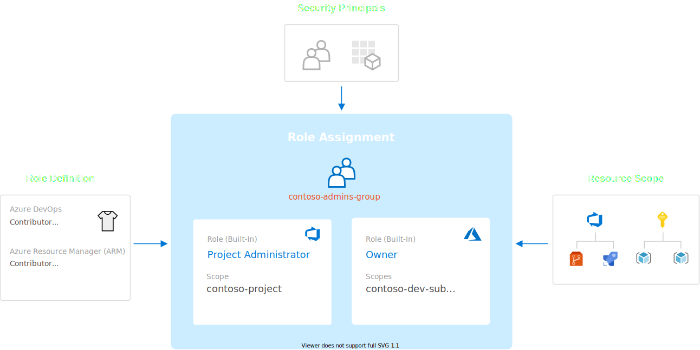
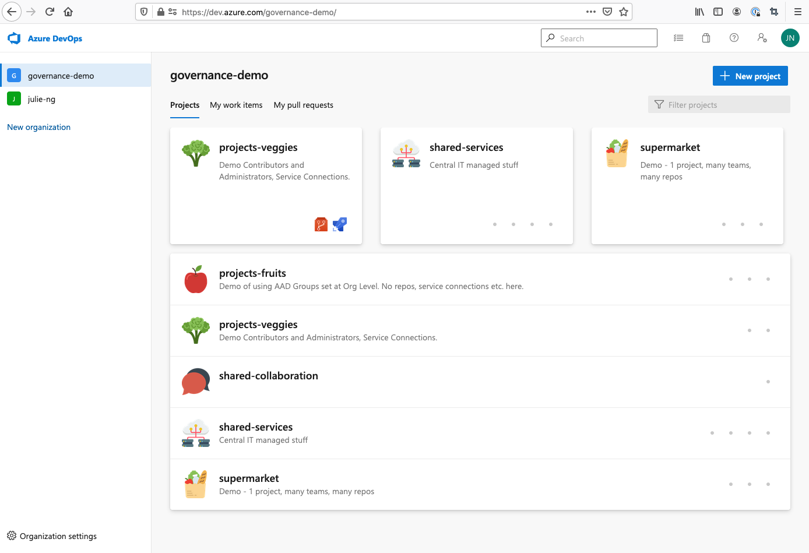

# Governance on Azure Demo - from DevOps to ARM

This demo project deploys Azure resources and bootstraps Azure DevOps projects to illustrate end-to-end RBAC, including best practices and pitfalls. It follows principles from Microsoft's [Cloud Adoption Framework (CAF)](https://docs.microsoft.com/en-us/azure/cloud-adoption-framework).

| Status | Description |
|:--|:--|
|  | Deployment Azure Resources and Azure DevOps |
|  | Detect Configuration Drift (scheduled nightly) |

### Contents

- [What is End to End Governance?](#what-is-end-to-end-governance)  
- [Deploy Example with Terraform &rarr;](./DEPLOY.md)
- [Understanding this demo](#understanding-this-demo)

## What is End to End Governance?

When developing a governance model for your organization, it is important to remember that Azure Resource Management (ARM) is only _one_ way to manage resources. 

When introducing automation via CI/CD pipelines, be aware that the Role Based Access Control (RBAC) model must be applied at **multiple layers**. This code sample deploys many of these layers and show how they can be configured together in a unified governance model. 

In a nutshell, you can achieve this by leveraging Azure Active Directory and connecting all role assignments (both Azure DevOps _and_ ARM) to this single identity management plane.

### Official Documentation

This repository features the code to deploy the infrastructure and bootstrap Azure DevOps. For more about the concept of end to end governance, please see:

- [Azure Architecture Center - End-to-end governance in Azure when using CI/CD](https://aka.ms/architecture-e2e-governance)  
  More technical documentation with step by step walkthrough of diagram above and how to leverage Azure AD as single identity provider for unified RBAC. 

- [Cloud Adoption Framework - End-to-end governance from DevOps to Azure](https://aka.ms/caf-e2e-devops)  
  Explains Role Assignments and the planning required for organizations in their cloud journey to create end to end governance.

## Understanding this Demo

The Terraform Infrastructure as Code in this repository will bootstrap various resources for you:

- Azure Resources (ARM)
- Azure AD Groups
- Service Principals
- Azure DevOps Projects incl. Service Connections, Security Group Assignments, etc.

#### Random Generated Suffix

When ran, Terraform will create the following resources. Note: random suffix are used to ensure globally unique names, e.g. `u6t7` but are omitted here for clarity.

### Azure AD Groups

The key to end to end governance is to have _multiple_ role assignments (with different role definitions and different resource scopes to the same Azure AD groups) as illustrated below. 

To understand the benefits, imagine you had to remove a contractor after completion of a project. If you use the concept described in this project and in the accompanying [official Microsoft documentation](https://aka.ms/architecture-e2e-governance), you can remove their access from multiple environments and resources simply by removing their membership to AAD group(s).

Note: the `-all` groups are currently not in use but was introduced to address a conceptual problem (see [#12](https://github.com/Azure/devops-governance/issues/12)):

- Azure Resource Manager uses an [_additive_ permissions](https://docs.microsoft.com/en-us/azure/role-based-access-control/overview#multiple-role-assignments) model
- Azure DevOps uses a [_least_ permissions](https://docs.microsoft.com/en-us/azure/devops/organizations/security/about-permissions?view=azure-devops&tabs=preview-page) model

| Group Name | ARM Role | Azure DevOps Role |
|:--|:--|:--|
| `fruits-all` | - | - |
| `fruits-devs` | Contributor | Contributor |
| `fruits-admins` | Owner | Project Administrators |
| `veggies-all` | - | - |
| `veggies-devs` | Contributor | Contributor |
| `veggies-admins` | Owner | Project Administrators |
| `infra-all` | - | - |
| `infra-devs` | Contributor | Contributor |
| `infra-admins` | Owner | Project Administrators |

In the future when we bootstrap the `supermarket` project, we will need the `-all` groups as well.

### Azure DevOps Projects

The project structure illustrates different governance models and their trade-offs. 

_Screenshot of the Azure DevOps organization created by this code sample. Icons by [Smashicons](https://www.flaticon.com/authors/smashicons) not included._

- "fruits" and "veggies" when isolated means less governance management - at the cost of less collaboration. 
- "supermarket" model prioritizes collaboration via shared Azure Boards - but requires more governance management, especially for repositories and pipelines.

| Project | Boards | Repos | Pipelines | 
|:--|:--|:--|:--|
| `project-fruits` |  Yes | Yes | Yes | 
| `project-veggies` | Yes | Yes | Yes | 
| `collaboration` | Yes | No | No | 
| `central-it` | No | Yes | Yes | 
| `supermarket` | Yes | Yes | Yes | 

### Azure Pipelines

- **Service Connection** using Contributor Service Principal
- **Service Connection** using Key Vault read-only Service Principal for Pipeline Secrets Integration

Note: At the time of this writing there is [no REST API (v6) for Key Vault Integration](https://docs.microsoft.com/en-us/rest/api/azure/devops/distributedtask/variablegroups/add?view=azure-devops-rest-6.0). Therefore it must be [configured manually](https://docs.microsoft.com/en-us/azure/devops/pipelines/release/azure-key-vault?view=azure-devops). 

### Azure Resource Groups as "Environments"

To reduce complexity for CI/CD automation of _this_ open source repository, this project uses resource groups as a logical and security boundary for deployments.

- `fruits-dev-rg`
- `fruits-prod-rg`
- `veggies-dev-rg`
- `veggies-prod-rg`
- `infra-shared-rg`

Be aware that in practice per [Cloud Adoption Framework](https://docs.microsoft.com/en-us/azure/cloud-adoption-framework), these boundaries [should be Azure Subscriptions](https://docs.microsoft.com/en-us/azure/cloud-adoption-framework/govern/guides/standard/#governance-best-practices), not Resource Groups.

# Contributing

This demo was created with &hearts; by the FastTrack engineer [Julie Ng](https://github.com/julie-ng) and based on previous experience as an Enterprise Architect and current experience with Azure customers new to CI/CD and DevOps. After regularly breaking and fixing the demo in onboarding sessions, it was automated.

Learn more about [FastTrack for Azure &rarr;](https://aka.ms/fasttrackforazure)

## Code of Conduct

If you want to contribute, please first read the Microsoft [Code of Conduct &rarr;](./.github/CODE_OF_CONDUCT.md)

## Bugs and Suggestions

The easiest way to contribute is to provide feedback.

* **Report Bugs**  
	If you find issues, please [open a GitHub issue &rarr;](https://github.com/Azure-Samples/devops-governance/issues)

* **Feature Requests**  
	Feel free to make suggestions by [opening a GitHub issue &rarr;](https://github.com/Azure-Samples/devops-governance/issues)
	
* **Ask a Question**  
	Please also [open a GitHub issue &rarr;](https://github.com/Azure-Samples/devops-governance/issues)
	
## Code Contributions

This project affects _real_ Azure resources and leverages CI/CD to safeguard them. Therefore please read through all the sections below carefully for highest success of your contribution being accepted.

- #### Use Conventional Commits
  Please use [Conventional Commits](https://www.conventionalcommits.org/en/v1.0.0/) so we can _automate_ the Change Log. Thank you.

- #### Create a Fork and Use small branches

  To get started, fork this repository. Please make your changes in your fork in **a feature branch**, ideally beginning with `feat/*` or  `fix/*`

  Large Pull Requests can be a challenge to merge. Consider separating changes are you would into smaller bits like features and create separate pull requests for each.

- #### Create a Pull Request
  
  Only Pull Requests with passing CI builds can be accepted for merging.
  
  When you are ready and checked you have met all code requirements described above, you can open a pull request.	When you do so, a CI build should be automatically started. If you're having difficulty, please feel free to reach out for help by [opening an issue](https://github.com/Azure-Samples/devops-governance/issues) or via Twitter [@jng5](https://twitter.com/jng5).

## License

This project is published under the MIT license. See [LICENSE.md](./LICENSE.md) for details.
