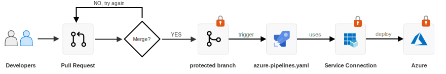

# Governance on Azure Demo - from DevOps to ARM

This demo project deploys Azure resources and bootstraps Azure DevOps projects to illustrate end-to-end RBAC, including best practices and pitfalls. It follows principles from Microsoft's [Cloud Adoption Framework (CAF)](https://docs.microsoft.com/en-us/azure/cloud-adoption-framework).

| Status | Description |
|:--|:--|
|  | Deployment Azure Resources and Azure DevOps |
|  | Detect Configuration Drift (scheduled nightly) |

### Abstract

When developing a governance model for your organization, it is important to remember that Azure Resource Management (ARM) is only _one_ way to manage resources. 

When introducing automation via CI/CD pipelines, be aware that the Role Based Access Control (RBAC) model must be applied at **multiple layers**. This code sample deploys many of these layers and show how they can be configured together in a unified governance model. 

### Table of Contents

- #### [Concept](./CONCEPT.md)
  - Use Case, Requirements
  - Azure AD Groups and Role Based Access Controls (RBAC)
  - Securing environments - Production vs Non-production
  - Multi-tiered Governance - Access Controls 
  
- #### [Deploy Example with Terraform](./TERRAFORM.md)
  - Prerequisites
    - Azure Resource Manager (ARM) - Service Principal
    - Azure AD - Tenant, Service Principal 
    - Azure DevOps - Organization, Personal Access Token (PAT)
  - Setup and Install
  - Deploy

## Azure Resources Created

When run Terraform will create the following resources. Note: random suffix used to ensure globally unique names, e.g. `u6t7` but are omitted here for clarity.

### Azure AD Groups

| Group Name | ARM Role | Azure DevOps Role |
|:--|:--|:--|
| `infra` | Contributor | Contributor |
| `fruits` | Contributor | Contributor |
| `veggies` | Contributor | Contributor |
| `infra-admins` | Owner | Project Administrators |
| `fruits-admins` | Owner | Project Administrators |
| `veggies-admins` | Owner | Project Administrators |

### Azure DevOps

#### Projects

The project structure illustrates different governance models and their trade-offs. 

- "fruits" and "veggies" when isolated means less governance management - at the cost of less collaboration. 
- "supermarket" model prioritizes collaboration via shared Azure Boards - but requires more governance management, especially for repositories and pipelines.

| Project | Boards | Repos | Pipelines | 
|:--|:--|:--|:--|
| `project-fruits` |  Yes | Yes | Yes | 
| `project-veggies` | Yes | Yes | Yes | 
| `collaboration` | Yes | No | No | 
| `central-it` | No | Yes | Yes | 
| `supermarket` | Yes | Yes | Yes | 

Preview of the Azure DevOps organization created by this code sample. Icons by [Smashicons](https://www.flaticon.com/authors/smashicons) not included.

#### Azure Pipelines

- **Service Connection** using Contributor Service Principal
- **Service Connection** using Key Vault read-only Service Principal for Pipeline Secrets Integration

Note: At time of this writing there is [no REST API (v6 )for Key Vault Integration](https://docs.microsoft.com/en-us/rest/api/azure/devops/distributedtask/variablegroups/add?view=azure-devops-rest-6.0). Therefore it must be [configured manually](https://docs.microsoft.com/en-us/azure/devops/pipelines/release/azure-key-vault?view=azure-devops). 

### Azure Resources (ARM)

#### Resource Groups aka Environment

N.B. Each resource group is intended to be a logical and security boundary, i.e. "environment". In practice per [Cloud Adoption Framework](https://docs.microsoft.com/en-us/azure/cloud-adoption-framework), these boundaries [should be Azure Subscriptions, not Resource Groups](https://docs.microsoft.com/en-us/azure/cloud-adoption-framework/govern/guides/standard/#governance-best-practices).

- `fruits-dev-rg`
- `fruits-prod-rg`
- `veggies-dev-rg`
- `veggies-prod-rg`
- `infra-shared-rg`

#### Environment Resources

Each "environment" has

- Azure Storage Account
- Azure Key Vault
- Service Principal - Contributor for automation
- Service Principal - Read-Only for Key Vault (used for Integration with Azure Pipelines Secrets)

# Contributing

This demo was created with &hearts; by the FastTrack engineer [Julie Ng](https://github.com/julie-ng) and based on experience with Azure customers new to CI/CD and DevOps. After regularly breaking and fixing the demo in onboarding sessions, it was automated.

Learn more about [FastTrack for Azure &rarr;](https://aka.ms/fasttrackforazure)

## Code of Conduct

If you want to contribute, please first read the Microsoft [Code of Conduct &rarr;](./.github/CODE_OF_CONDUCT.md)

## Bugs and Suggestions

The easiest way to contribute is to provide feedback.

* **Report Bugs**  
	If you find issues, please [open a GitHub issue &rarr;](https://github.com/Azure-Samples/devops-governance/issues)

* **Feature Requests**  
	Feel free to make suggestions by [opening a GitHub issue &rarr;](https://github.com/Azure-Samples/devops-governance/issues)
	
* **Ask a Question**  
	Please also [open a GitHub issue &rarr;](https://github.com/Azure-Samples/devops-governance/issues)
	
## Code Contributions

This project affects _real_ Azure resources and leverages CI/CD to safeguard them. Therefore please read through all the sections below carefully for highest success of your contribution being accepted.

- #### Use Conventional Commits
  Please use [Conventional Commits](https://www.conventionalcommits.org/en/v1.0.0/) so we can _automate_ the Change Log. Thank you.

- #### Create a Fork and Use small branches

  To get started, fork this repository. Please make your changes in your fork in **a feature branch**, ideally beginning with `feat/*` or  `fix/*`

  Large Pull Requests can be a challenge to merge. Consider separating changes are you would into smaller bits like features and create separate pull requests for each.

- #### Create a Pull Request
  
  Only Pull Requests with passing CI builds can be accepted for merging.
  
  When you are ready and checked you have met all code requirements described above, you can open a pull request.	When you do so, a CI build should be automatically started. If you're having difficulty, please feel free to reach out for help by [opening an issue](https://github.com/Azure-Samples/devops-governance/issues) or via Twitter [@jng5](https://twitter.com/jng5).

## License

This project is published under the MIT license. See [LICENSE.md](./LICENSE.md) for details.