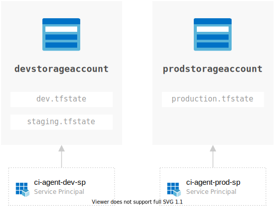

# Terraform State Management

## Local State - Default

By default this project uses local state for low barrier to entry for you to deploy and learn about end to end governance.

In this way, you would only* need the following Terraform commands.

```bash
terraform init
terraform plan
terraform apply
```

_*assuming you've already logged into Azure and set your Azure DevOps Personal Access Token (PAT)_

## Remote State - for CI

If running with CI or sharing between engineers, you would choose to store state in an Azure Storage Account.

And to comply with governance best practices, we have 2 different storage accounts to create a security boundary between production and non-production resources.




### Setup

Copy `backend.hcl.sample` to for example, `dev.backend.hcl` and edit the contents to point to your storage account and state file.

### Multiple environments

To target **development** setup:

```
terraform init -backend=true -backend-config=./backends/dev.backend.hcl
```

To target **production** setup:

```
terraform init -backend=true -backend-config=./backends/prod.backend.hcl
```