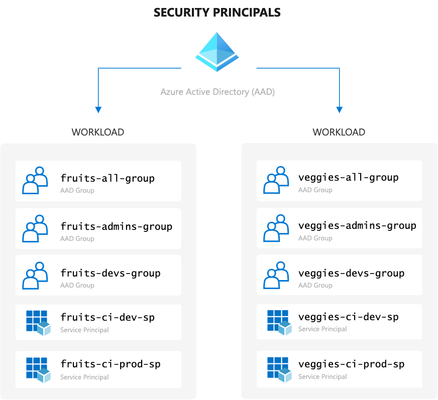
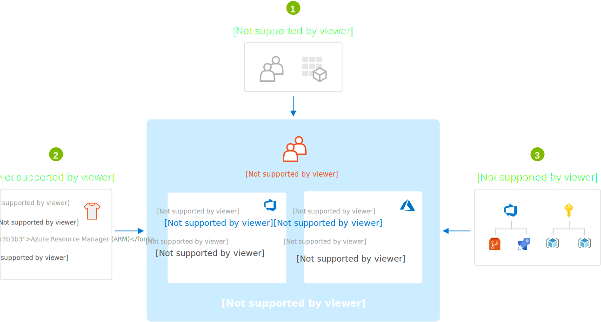

# Identity and the Role Assignments Crux

Status: Draft  
Author: Julie Ng  
Last Updated: March 2021

The crux of any governance model is taming exponential access controls. Role Based Access Control (RBAC) and central identity management will help. But the crux is to elegantly slice your groups and permissions scopes.

The key to having end to end RBAC model is having a single unified identity provider for all steps in the deployment workflow:

- Git Repositories
- CI/CD Server
- Cloud Resources

### Segment Identities By Workload

In Azure terminalogy any actor that needs access to your resources is a Security Principal. For the purpose of an E2E Governance concept, we are interested in:

- AAD groups, which hold User Principals (human actors)
- Service Pricipals (headless actors)

This diagram shows how our identities are segmented by workload, e.g. fruits vs vegggies. 



_**Figure 1 - Security Principals - Segmented by Workload**_

### Leverage Azure Active Directory (AAD) Groups 

Azure Active Directory (AAD) serves as the central identity provider and will be leveraged on both Azure DevOps and Azure Resource Manager (ARM) layers. 

Complexity increases as the number of workloads and environments increase. For every deployment workflow we want apply permissions to groups once and not multiple times for each individual. 

Additionally if for example a developer leaves the team, you can remove them from the AAD group, thus revoking their permissions in _both_ Azure DevOps and ARM with _one_ action. 

#### Example Scenarios

- When working on "fruits" workloads, Amy has elevated privileges and can manage permissions on behalf of her team. She can _change the permissions model_.

- If the team however collaborates with another product, e.g. "supermarket", Amy may only have default permissions. She must operate within the existing permissions model.

In order to scale with consistent results, it is important to limit the number of people privileged access. Deviations from a central governance model should be the exception, not the rule. 

## Roles

Our End to End Governance model uses a Role Base Access Control (RBAC). We will also follow the Principle of Least Privilege (PoLP) and grant the _least_ number of permissions required to perform a role. In practice this means we have 3 broad role categories:

- **Reader**  
  Read-only access. Use cases include stakeholder access or reduced privileges on critical resources i.e. production environments.

- **Contributor**  
	Read and write access to most resources. This is the default role for developers.

- **Elevated Privileges**  
  Can change the permissions model and thus only a subset of developers have this role. Non-technical business owners may also have this role.
	- In Azure DevOps this role (aka Security Group) is called "Project Administrator" 
	- In ARM this role is called "Owner"

### ProTip - Use a Custom Role for Automated Deployments

It is a common mistake to give CI/CD build agents Owner roles and permissions. Contributor permissions are not enough if your build agents also need to create and update Key Vault Access Policies. 

With great power comes great responsibility. Unfortunately are build agents are headless (thus brainless) and should not be 100% trusted. 

#### Reasons Not to Trust Build Agents

A CI/CD Build Agent will happily delete your entire production environment if told so. Maybe you want that, for example for cleaning up non-production environments. However, there are a few scenarios that we want to avoid:

- remove the Administrator's access to a resource (locking yourself out)
- remove [management lock](https://docs.microsoft.com/en-us/azure/azure-resource-manager/management/lock-resources) that by design should prevent resources from being deleted (common requirement in regulated industries)

Therefore we will create a custom role and remove the `Microsoft.Authorization/*/Delete` actions.

```json
{
  "Name": "Headless Owner",    
  "Description": "Can manage infrastructure.",
	"actions": [
		"*"
	],
  "notActions": [
    "Microsoft.Authorization/*/Delete"
  ],
  "AssignableScopes": [
    "/subscriptions/{subscriptionId1}",
    "/subscriptions/{subscriptionId2}",
    "/providers/Microsoft.Management/managementGroups/{groupId1}"
  ]
}
```

 If that removes too many permissions, refer to the full list in [official documentation](https://docs.microsoft.com/en-us/azure/role-based-access-control/resource-provider-operations#management--governance) and adjust your role definition accordingly.

## Role Assignments

Until now we have discussed Role _Definitions_. Roles themselves do not have any effect until you assign them to actors, i.e. security principals.

A common mistake organizations new to the cloud make is to mix roles and AAD groups. 

For example, do not create AAD groups with such names:

- `fruits-dev-team`
- `fruits-prod-team`
  
In this example, group memberships have been confused and mixed with with roles. Roles do not change across environments, which is actually just a resource scope. Instead _**role ssignments**_ change.

End to End Governance means we will secure the ARM resources themselves and apply the same RBAC model to Azure DevOps. This diagram illustrates how the `veggies-admin-group` AAD group receives:

- **Project Administrator** role in Azure DevOps scope
- **Owner** role in Azure Resource Manager (ARM) scope
 

_**Figure 3 - Anatomy of a Role Assignment**_

### Example Assignment Matrix

The `veggies-admin-group` example is straightforward and simple to understand. Let's expand on our example and imagine our Fruits and Veggies are going to collaborate on a new project - a Supermarket. For this project the company's enterprise architect created this RBAC Model: 

| Group Name | Azure DevOps | Dev Environment (ARM) | Production Environment (ARM) |
|:--|:--|:--|:--|
| `fruits-group` | Contributor | Contributor | Reader |
| `veggies-group` | Contributor | Contributor | Reader |
| `market-group` | Contributor | _Owner_ | Reader |
| `market-admins` | Project Administrator | Owner | Owner |
| `market-ci-dev-sp` | - | _Headless Owner_  | - |
| `market-ci-prod-sp` | - | - | _Headless Owner_ |

Pay specific attention to

- Service Principals have custom role of "Headless Owner" described in previous sections about why you should not trust a build agent.
  
- The `market-group` has **Owner** role on their non-production environment. This gives the entire team flexibilty to iterate and innovate quickly. If an experiment blows up their infrastructure, they can re-create it themselves.